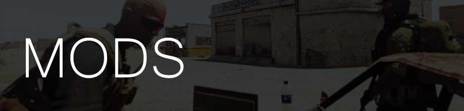

# Black Gold - Redux
**Contrato #294**  
**Contratante:** Petróleo Brasileiro S.A. - Petrobras    
**Unidade Responsável:** Kaiser  
**Tipo de operação:** Não sancionada.  
**Suporte:** Não disponível  
**Horário:** 1730  
**Tempo:** Limpo / Possibilidade de Tempestade de Areia

# 

# SITUAÇÃO
14 de Maio de 2016  
Bem vindos a Shapur, Kaiser. O inferno deve ser menos quente que aqui.  

A razão de nossa presença nesta região esquecida por Deus é danificar o monopólio petrolífico da CNOI, a Compania Nacional de Óleo do Iraq. Nosso contratante, a Petrobrás, precisa que isso aconteça para forçar o governo Iraquiano a aceitar ajuda privada externa, que já foi oferecida por meios convencionais sem sucesso. Dessa maneira, nosso contratante tem acesso a susbstanciais reservas de óleo em uma região de alto valor logístico.  

A região é atualmente ocupada pelo exército americano, que também tem interesses nas reservas da região e já firmou um acordo com o governo local para proteção e fornecimento de pessoal para manter as usinas petrolificas funcionando.  
O acesso ao local é extremamente seguro, impossibilitando ataques mais tradicionais. Além disso, é de extrema importância que nossa presença na região não seja descoberta.  

Para facilitar nossa entrada, Corona contactou Gregor Costas (codinome: Onça), um comerciante local que diz ter ligações com pessoas dentro do exército americano. Segundo ele, já estaria arranjado uma facilitação de acesso através de um Tenente local (codinome: Rato) que não está tão feliz com seu salário. Rato disponibilizou acesso terrestre, que transportará nossa unidade até ele usando um motorista de sua confiança.  

Onça acredita que estamos indo a seu encontro para efetuar seu pagamento. Entretanto, Corona quer que eliminemos Onça e Rato a fim de assegurar nossa identidade na região. Isso inclui o motorista e demais unidades fiéis a Rato.  

Para que a CNOI peça ajuda externa, nosso contratante apontou dois objetivos que precisam ser cumpridos.  

Precisamos localizar e eliminar Mark Husseinberg (codinome: Jaleco), um engenheiro americano que está supervisionando a operação local. Corona acredita que ele está alocado em Shapur-1, uma central de refino e logística.   

Além disso, é de extrema importância que quatro unidades de armazenamento sejam destruídas. Isso irá resultar em uma reação em cadeia que desestabilizará toda a operação local. A localização dessas unidades estão marcadas em seus mapas.  

Nosso contratante não especificou a ordem em que elas devam ser executadas.  

Corona fez o transporte de Onça em um de nossos KA-60 e o posicionou no aeroporto local. Esse será o veículo de extração, que deverá voar até Golf, onde unidades de logística AEGIS estarão aguardando.

Entretando, Corona faz um aviso: Uma grande tempestade de areia se aproxima da região.  
A visibilidade pode ficar comprometida.  

O valor do contrato para essa operação é de **US$ 1.5 milhões**.  

# MISSÃO
**Kaiser** deve fazer a inserção terrestre e eliminar Rato e Onça no local de encontro.  

Após a eliminação dos contatos iniciais, deve assegurar a neutralização de 4 unidades de armazenamento.  
Corona acredita que **1 Satchel** para cada unidade deve ser o suficiente.  

Em seguida, encontrar e eliminar Mark Husseinberg, em SHAPUR-1. Imagens do Hannibal-6 indicam presença hostil reforçada no local. Se possível, minimizem confrontos diretos.  

A extração será feita por um de nossos KA-60, posicionado no aeroporto local.  
Será necessário um dos membros de Kaiser para pilotar a aeronave até o ponto de encontro Golf.  

# RELATÓRIO DE UNIDADES
A região é atualmente ocupada pelo exército americano.  
Corona acredita que nossa presença inicialmente não levante suspeitas, entretanto, não recomenda fogo direto.  
Segundo imagens do Hannibal-6, espera-se em torno de 20-50 homens na região, incluíndo civis.  
A maior concentração de unidades inimigas encontra-se na região da Base Avançada Andreas.  
# EXECUÇÃO
1- Fazer a aproximação do local do encontro por via terrestre.  
2- Identificar **Onça** e **Rato** e fazer a eliminação de ambos.  
3- Determinar localização de **Jaleco** e fazer sua eliminação.    
4- Determinar localização das unidades de armazenamento e fazer sua neutralização.  
5- Fazer a aproximação do aeroporto local e identificar aeronave de extração.  
6- Abordar aeronave e fazer voo até ponto **Golf**.  

# CALLSIGNS
**KAISER:** Equipe AEGIS  
**CORONA:** Comando AEGIS  
**Onça:** Gregor Costas, nosso contato e facilitador.  
**Rato:** Tentente americano, contato de Costas.  
**Jaleco:** Mark Husseinberg, engenheiro americano.  
**Golf**: Local de encontro com equipe AEGIS Logística.  

Boa sorte!

# 
Todos os mods abaixo são necessários para a missão.
- [@ASR_AI3 - 0.9.1](http://www.armaholic.com/page.php?id=24080)
- [@ace3 - 3.4.1](https://github.com/acemod/ACE3/releases/)
- [@acre2 - 2.1.0.811](http://www.armaholic.com/page.php?id=19324)
- [@aegis - 0.7](https://github.com/aegisarma3/ASIN/releases/download/v0.7/aegis.zip)
- [@aegisremote - 0.1](https://github.com/aegisarma3/aegisremote/releases/download/v0.1/aegisremote.zip)
- [@cup_terrains - 1.0.1 Complete](http://cup-arma3.org/downloads/cup-terrains/)
- [@aegis_agressors - 0.1](https://github.com/aegisarma3/aegis_aggressors/releases/download/v0.1/aegis_aggressors.zip)
- [@cba_a3 - 2.3.1.160220](http://www.armaholic.com/page.php?id=18767)
- [@DAC - 3.1b](http://www.armaholic.com/page.php?id=25550)
- [@em - 0.63 beta](http://www.armaholic.com/page.php?id=27224)
- [@melb - 0.00003](http://www.armaholic.com/page.php?id=28856)
- [@mrt_accfncs - 1.20](http://www.armaholic.com/page.php?id=26426)
- [@plp_containers - 0.7 beta](http://www.armaholic.com/page.php?id=29295)
- [@sma - 2.3](http://www.armaholic.com/page.php?id=26428)
- [@tryk - 0.9.4 beta](http://www.armaholic.com/page.php?id=26661)

## Mods utilizados no server:
- [@aegisserver - 0.2](https://github.com/aegisarma3/aegisserver/releases/download/v0.2/aegisserver.zip)
